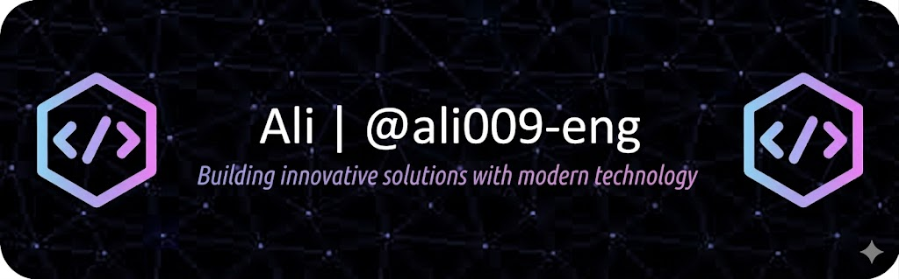

<h1 align="center">
    
</h1>

### IT student focused on data science and ML engineering, building real-world projects with cloud, MLOps, and scalable systems.

<h1 align="center">
    
</h1>

### IT student focused on data science and ML engineering, building real-world projects with cloud, MLOps, and scalable systems.

- 🌱 I’m currently learning **Machine Learning Engineering, MLOps, System Design, and Advanced Algorithms**
- 💬 Ask me about **Python, Machine Learning, Data Science, Azure, APIs, and Backend Development**  
  👉 https://github.com/ali009-eng/ali009-eng/issues

 

  
  

